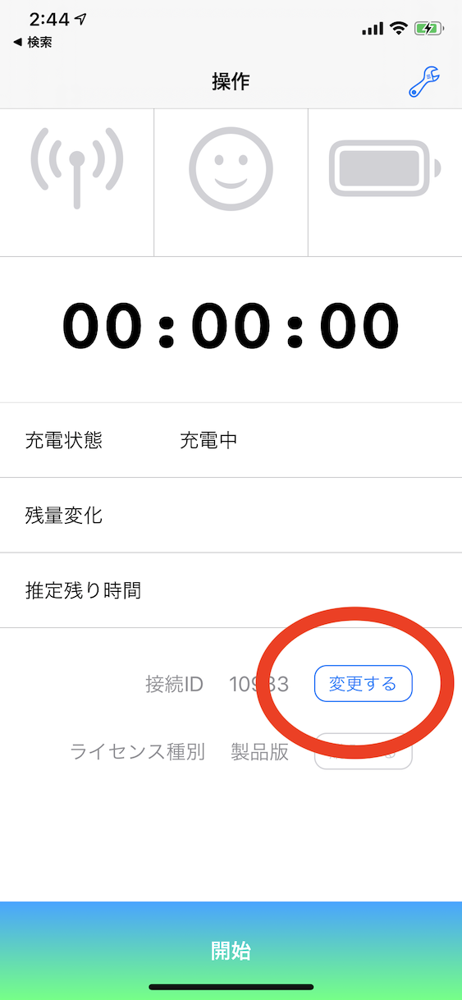

# 導入

恋顔が使えるようになるまでの手順を説明します。

## PC用アプリをダウンロード

ご利用のOSに合わせて必要なファイルをダウンロードしてください。

- macOS版: Koigao.pkg
  - ダウンロードしたインストーラを開いて指示に従ってください。
- Windows版: Koigao_win.zip
  - ダウンロードしたzipを展開してください。

ダウンロードは [こちら](https://github.com/hiragram/koigao-release/releases/latest) から。

## iPhone用アプリをダウンロード

以下からiPhone用アプリをダウンロードしてください。
現在PCでご覧の方は、iPhoneのカメラにQRコードを映すとAppStoreに飛べて便利です。

https://apps.apple.com/jp/app/id1507679306

## PCとiPhoneを同じWifiに接続する

恋顔は、PCとiPhoneが同じネットワークに接続されていないと動作しません。また、一般的な家庭のネットワークを想定しており、オフィス環境や公衆wifiなどでの動作はサポートしていません。

## PC用アプリを起動する

macOSの方は `/Applications` にインストールされた `Koigao.app` を、Windowsの方はzipを展開したフォルダの `Koigao.exe` を起動します。

セキュリティ警告やネットワーク警告が出た場合は、実行を許可してください。iPhoneから接続するために必要になります。

Windowsの以下のアラートは、「詳細情報」→「実行」

画面サイズや描画品質はお好みで選択して、Playボタンを押します。

## iPhone用アプリで接続IDを設定する

PC用アプリとiPhone用アプリを連携させるため、共に同じ接続IDを使用する必要があります。

iPhone用アプリを起動し、接続IDを「変更する」ボタンを押します。

変更画面が表示されるので、PC用アプリの左上に表示されている5桁の数字を入力しOKを押してください。

正常に設定ができていれば、iPhone用アプリの画面一番下にある「開始」ボタンを押すと顔認識が始まり、PC用アプリでモデルが動き始めます。

PC用アプリでEnterキーを押すと、接続IDなどの情報が非表示になります。

**Windows版をご利用の方は、さらに設定が必要な場合があります。動かない方は [こちら](./windows_setup_bonjour.html) を参考に設定してください。**

ここまででiPhone用アプリとPC用アプリの連携設定は完了です。ご自身のモデルへの差し替えや、その他の機能の紹介は [こちら](./features.html)
