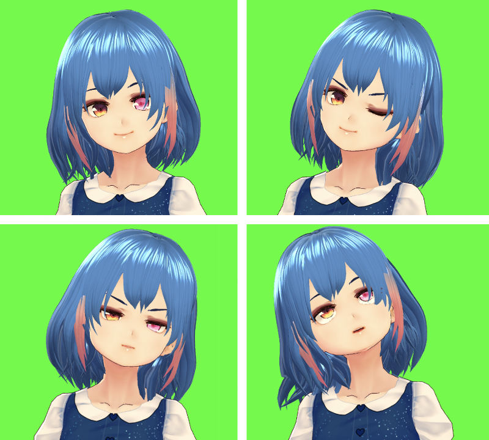

# 恋顔

恋顔(Koigao)は、より豊かな感情表現を目指すため、表情認識に特化したVTuber向けトラッキングシステムです。対応モデルのiPhoneと、macOS/Windowsのパソコンだけで3Dキャラクターを動かすことができます。

## 特徴

iPhoneX以降のFaceID対応モデルに搭載されたTrueDepthカメラを用いて表情認識をし、PC用恋顔アプリと通信することで3Dモデルを動かすことができます。

## 必要なもの

- TrueDepthカメラを搭載したiPhone
  - 指紋認証ではなく顔認証機能がついていれば利用可能です。
- macOSもしくはWindowsのパソコン
  - ご利用のパソコンが必要なスペックを満たすかどうかは、体験版にてご確認ください。
- iPhoneとパソコンが同じWi-Fiネットワークに接続されていること
  - 一般家庭での利用を想定しています。オフィス環境やイベント会場のような大規模なネットワークやカフェなどの公衆ネットワークでの利用は正式なサポートの範囲外です。体験版でご確認ください。
