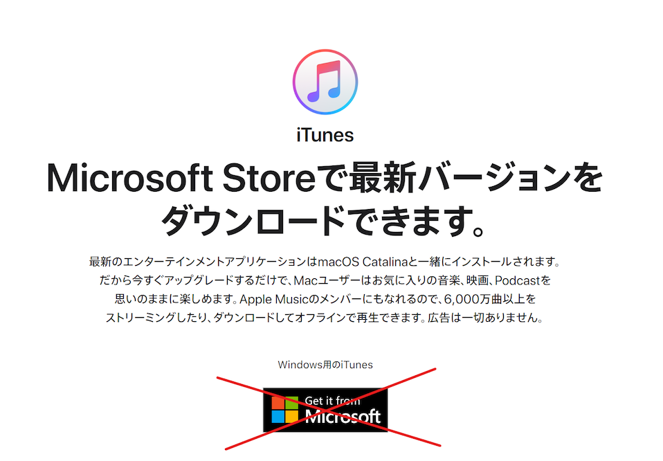

# WindowsにBonjourを導入する

Bonjourとは、Appleが開発する、ネットワーク内にある機器どうしを簡単に接続するための技術です。恋顔では、面倒なネットワーク設定をせずにiPhone用アプリからPC用アプリが動いているコンピュータを見つけるために利用されています。

Windows環境では、人によってBonjourがすでにインストールされていたりいなかったりします。この記事では、Bonjourが入っているかどうかの確認の仕方や、入っていない場合のインストールの仕方について説明しています。

## Bonjourが入っているかどうかを確認する

以下の手順で確認できます。

- スタートメニューに `cmd` と入力し、 `コマンドプロンプト` を選択

- 表示された黒い画面に、 `dns-sd -V` と入力してEnterキーを押す
  - 「`dns-sd` は、内部コマンドまたは外部コマンド、操作可能なプログラムまたはバッチファイルとして認識されていません。」と表示された場合、Bonjourは **入っていません**。インストールの手順に進んでください。
  - 「Currently running daemon ...(省略)」と表示された場合、Bonjourは **入っています**。にもかかわらず接続できない場合は、お手数ですがお問い合わせください。

## Bonjourをインストールする

コマンドプロンプトは閉じて構いません。
WindowsにBonjourをインストールする方法はいくつかあるので、お好きな方法を選んでください。

### 方法1. Microsoft Store版"ではない"iTunesをインストールする

Windows環境にBonjourをインストールする最も簡単な方法は、iTunesをインストールすることです。iTunesのインストール時にBonjourのプログラムもインストールされます。

ただし、 **Microsoft Storeからではなく、ブラウザで直接ダウンロードするバージョン** である必要があります。「iTunes入ってるはずなのに、Bonjourがインストールされていない」という方は、Microsoft StoreからiTunesをインストールしたのかもしれません。

*Microsoft Store版を引き続き使いたい、もしくはiTunesをインストールしたくないという方は、方法2をお試しください。*

[iTunesのダウンロードページ](https://www.apple.com/jp/itunes/) を開きます。
"Get it from Microsoft" **ではなく**、下にある「ほかのバージョンをお探しですか？」のWindowsをクリックします。

↓下にスクロールします。

インストーラのダウンロードが始まりますので、それに従ってインストールしたあと、もう一度入っているかの確認の手順を行ってください。

### 方法2. Bonjour SDKをインストールする(英語のページが怖くない方むけ)

[Appleのダウンロードページ](https://developer.apple.com/download/more/?=Bonjour%20SDK%20for%20Windows%20v3.0) を開きます。AppleIDでのログインを求められますが、普段iPhoneのAppStoreなどでお使いのAppleIDでログインできます。

"Bonjour SDK for Windows v3.0"を選択し、ダウンロードしてインストールします。完了後、入っているかの確認の手順を行ってください。
